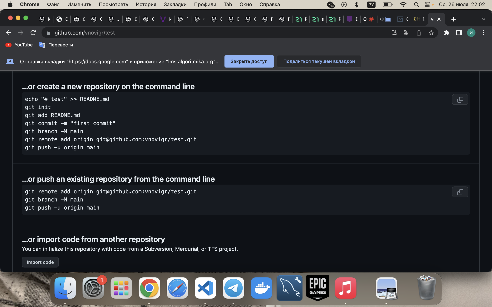
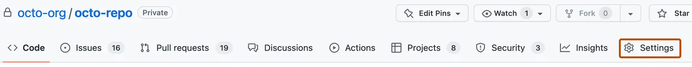
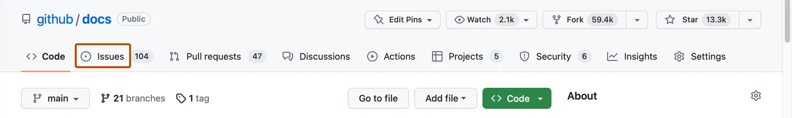
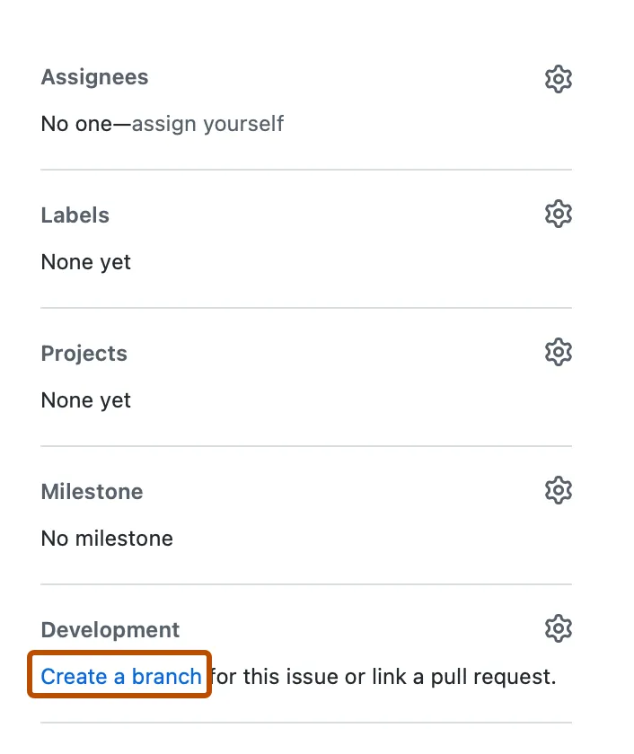
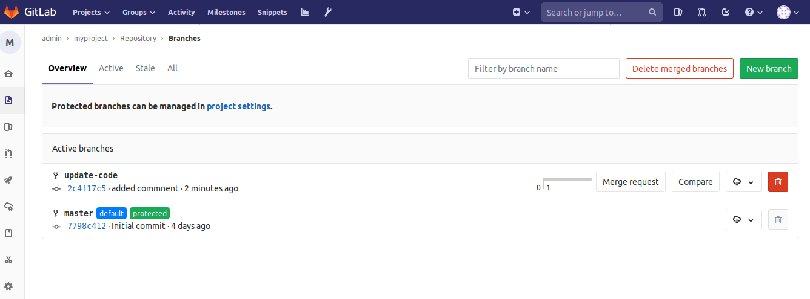
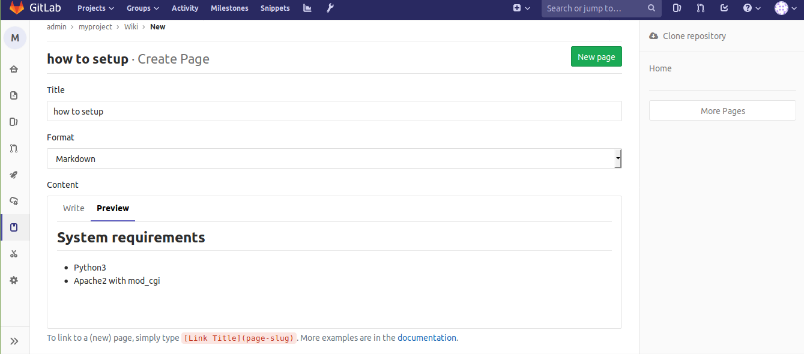

1. создание личного репозитория с нужным .gitignore и простым README.MD;
На сайте github в разделе "Repositories" нажимаем на зеленую кнопку "New", называем репозиторий, выбираем 
публичность, ставим галочку напротив "Add a README file", выбираем 'Add .gitignore' и нажимаем 'Create repository'. Дальнейшие команды создаем папку на компьютере с названием репозитория, дальнейшие команды 
2. создание веток develop и master;
git clone <link_repo>
git checkout -b develop
3. установка ветки develop по умолчанию;
Чтобы изменить ветвь по умолчанию, репозиторий должен иметь несколько ветвей.
На GitHub.com перейдите на главную страницу репозитория.
Под именем репозитория щелкните  Параметры. Если вкладка "Параметры" не отображается, выберите раскрывающееся меню  и нажмите кнопку Параметры.
Снимок экрана: заголовок репозитория с вкладками. Вкладка "Параметры" выделена темно-оранжевым контуром.

В разделе "Ветвь по умолчанию" справа от имени ветвь по умолчанию щелкните .
Выберите раскрывающееся меню ветвь и щелкните имя ветви.
Нажмите кнопку Обновить.
Прочтите предупреждение, а затем щелкните Я понимаю, обновите ветвь по умолчанию.
4. создание issue на создание текущего мануала;
На GitHub.com перейдите на главную страницу репозитория.
Под именем репозитория щелкните  Проблемы.
Снимок экрана: страница main репозитория. На горизонтальной панели навигации вкладка с меткой "Проблемы" выделена темно-оранжевым цветом.
Щелкните Новая проблема.
5. создание ветки по issue;
На GitHub.com перейдите на главную страницу репозитория.
Под именем репозитория щелкните  Проблемы.
Снимок экрана: страница main репозитория. На горизонтальной панели навигации вкладка с меткой "Проблемы" выделена темно-оранжевым цветом.

В списке проблем щелкните проблему, для которой нужно создать ветвь.
На правой боковой панели в разделе "Разработка" нажмите кнопку Создать ветвь. Если у проблемы уже есть связанная ветвь или запрос на вытягивание, выберите  и щелкните Создать ветвь.
Снимок экрана: боковая панель проблемы. В разделе "Разработка" ссылка с меткой "Создать ветвь" выделена темно-оранжевым цветом.

При необходимости в поле "Имя ветви" введите имя ветви.
При необходимости выберите раскрывающееся меню Назначение репозитория , а затем выберите репозиторий.
Щелкните Создать ветвь.
6. создание merge request по ветке в develop;
В ветках разрабатывается функциональность, поэтому может потребоваться их перенос — для этого предназначены запросы слияния («Merge request gitlab»). Для использования этой возможности в интерфейсе GitLab нужно нажать кнопку «Create merge request», задать описание «Merge Request», выбрать исходную и целевые ветки. После одобрения запроса на слияние надо нажать на кнопку «Merge». В результате файлы ветки преемника будут заменены файлами из ветки источника.
7. комментирование и принятие реквеста;
git clone <link-repo>
cd <project>
git checkout -b <new_branch>
делаем дела по коду
git add .
git commit -m 'updated code'
git push origin <new_branch>

Рядом с именем ветки есть кнопка Merge request
При нажатии на нее открывается диалог позволяющий задать описание, добавить комментарий, установить Milestone и выбрать кому из разработчиков будет отправлен MR.
Также можно установить, что нужно чье-либо одобрение для принятия Merge-request и слияния с веткой master.
После заполнения полей формы нужно нажать Submit merge request внизу.
Теперь тот кому отправлен MR получит оповещение и сможет увидеть все внесенные изменения, затем закрыть MR, выполнить слияние с master или начать дискуссию.
8. формирование стабильной версии в master с простановкой тега
Как и большинство других систем контроля версий, Git имеет возможность помечать определённые моменты в истории как важные. Как правило, эта функциональность используется для отметки моментов выпуска версий (v1.0, и т. п.). Такие пометки в Git называются тегами.
Git использует два основных типа тегов: легковесные и аннотированные.
Легковесный тег — это что-то очень похожее на ветку, которая не изменяется — просто указатель на определённый коммит.
А вот аннотированные теги хранятся в базе данных Git как полноценные объекты. Они имеют контрольную сумму, содержат имя автора, его e-mail и дату создания, имеют комментарий и могут быть подписаны и проверены с помощью GNU Privacy Guard (GPG). Обычно рекомендуется создавать аннотированные теги, чтобы иметь всю перечисленную информацию; но если вы хотите сделать временную метку или по какой-то причине не хотите сохранять остальную информацию, то для этого годятся и легковесные.
Создание аннотированного тега в Git выполняется легко. Самый простой способ — это указать -a при выполнении команды tag:
Опция -m задаёт сообщение, которое будет храниться вместе с тегом. Если не указать сообщение, то Git запустит редактор, чтобы вы смогли его ввести.
С помощью команды git show вы можете посмотреть данные тега вместе с коммитом:
Легковесный тег — это ещё один способ пометить коммит. По сути, это контрольная сумма коммита, сохранённая в файл — больше никакой информации не хранится. Для создания легковесного тега не передавайте опций -a, -s и -m, укажите только название:
На этот раз при выполнении git show для этого тега вы не увидите дополнительной информации. Команда просто покажет коммит:
9. Gitlab wiki — документация, которую можно вести для каждого проекта. Обычно это системные требования, описание пакетов и процесса установки.
В документации может содержаться информация, которая необходима для поддержки системы и к которому будут обращаться технические специалисты, которые занимаются её поддержкой.

Рассмотрим на примере как добавить документацию для проекта в Gitlab
Первой всегда добавляется главная страница Home.
Стандартным способом оформления является Markdown. Доступен режим Preview в котором видно как будет выглядеть текст.
В примере добавление заголовка h1 и выделение для команды python3 index.py
Чуть ниже показано как создать ссылку, ее текст указывается в скобках, сама ссылка — в квадратных скобках. Пока оставляем их пустыми и нажимаем New Page. Позже в квадратных скобках будет адрес второй страницы.
Title можно оставить how to setup. Далее содержимое в том же формате. Здесь это список.

При выборе Preview.
Теперь можно скопировать URL второй страницы и указать его как ссылку на первой.
В результате получилась минимальная Wiki с описанием тестового приложения. Также есть системные требования и указания по установке.
Чем сложнее проект, тем объёмнее должна быть документация по нему. Также хорошей практикой считается в директории со скриптами приложение размещать текстовый файл с инструкцией по разворачиванию, описанием принципов работы и ссылками на документацию с контактами разработчиков.
Wiki могут существовать для проектов, находящихся в общем доступе и для приватных репозиториев. Подробную документацию всегда стоит вести, это позволит удобно работать с проектом всем, кому это требуется.